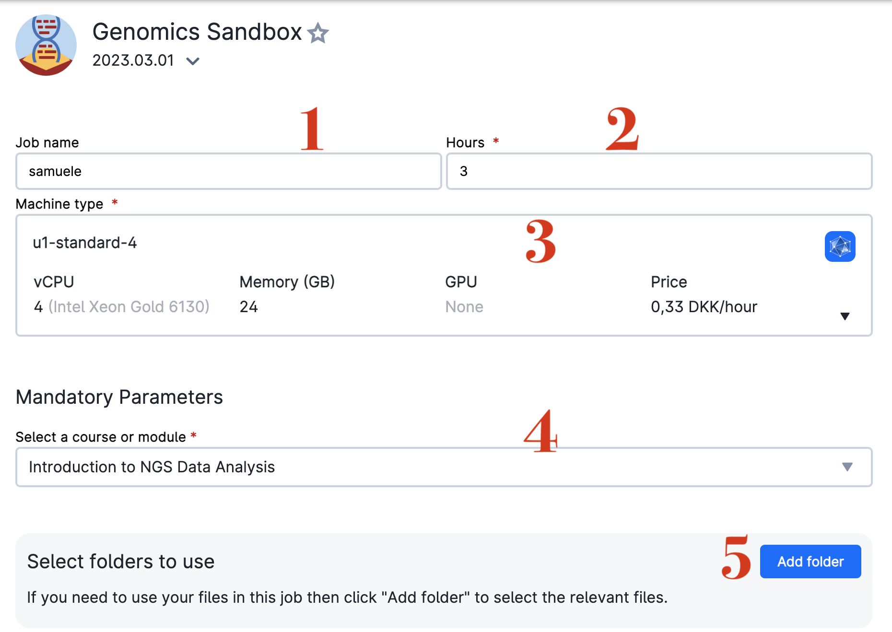
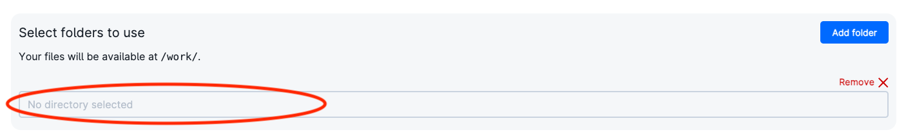
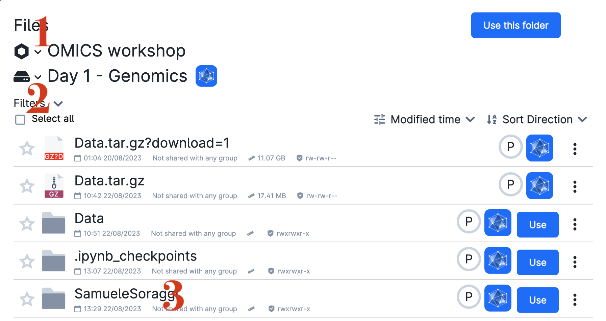
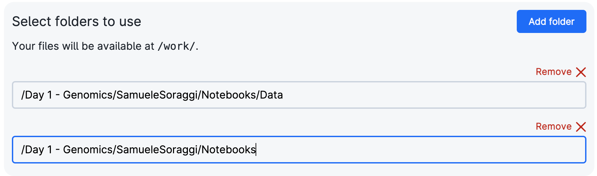
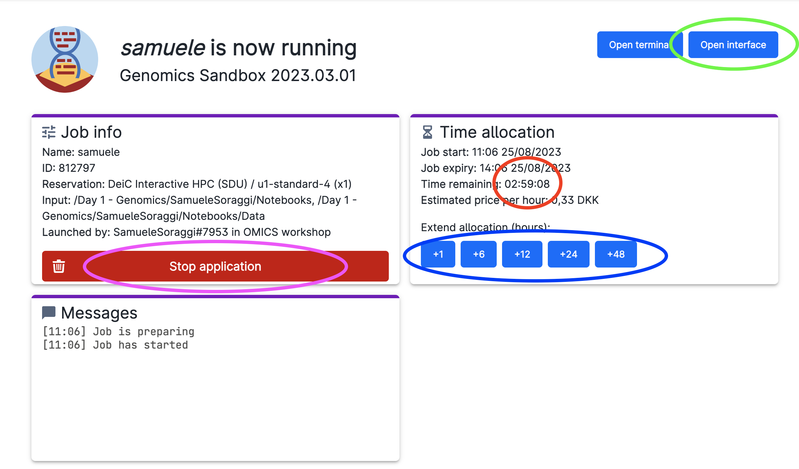
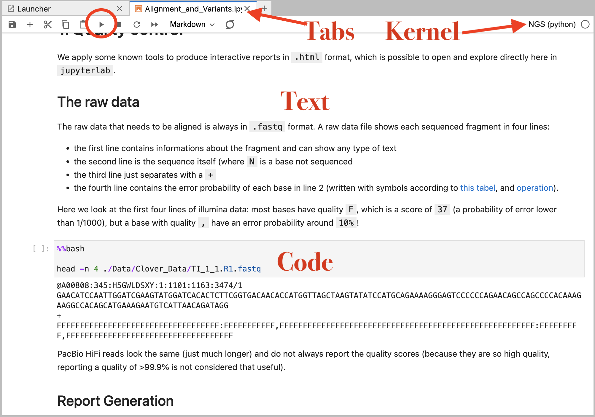

# Genomics workshop

This workshop goes through  the analysis of Genomics data from raw data quality control and alignment, to SNP calling and filtering. We will start from raw output of an illumina and PacBio Hifi machines.

!!! info "Goals"
    By the end of the genomics workshop, you will know how to

    - **perform and discuss quality control** on raw data in `fastq` format using `FastQC` and `MultiQC`
    - **align HiFi and RNA sequencing data** with dedicated tools such as `MiniMap2` and `STAR`
    - **analyze the quality** of the alignment with `qualimap`
    - **call variants** using alignment files
    - **extract data** from `VCF` files using `Python`
    - **filter and count** variants 

## Introductory Presentation (slides and video)

<a href="assets/OMICSworkshop2023Genomics.pdf" download>Download the slides in pdf format from this link</a>

## Step-by-Step tutorial

In what follows you will learn how to start the app to work on the tutorial. Then you have all the steps to perform the analysis of the data. The Genomics app contains various courses you can do on your own, but right now we will add manually the data and the notebooks for this workshop, since they have been tailored to fir into our time frame.

### Start the genomics sandbox app

The genomics sandbox is on `Ucloud`, an interactive online platform from the [University of Southern Danmark eScience center](https://escience.sdu.dk/) that allows users to execute softwares and computer code directly from their browser. If you are enrolled in a danish university or hospital, you can access the platform for free.

Please follow these instructions to access uCloud and get to work on the tutorial:

* Be sure you have joined the project `OMICS workshop`. Check if you have the project `OMICS workshop` from the project menu (red circle) and choose it. Afterwards, click on the `App` menu (green circle)

* Find the app `Genomics Sandbox` (red circle), which is under the title `Featured`.
  

* Click on it. You will get into the settings window. Choose any Job Name (Nr 1 in the figure below), how many hours you want to use for the job (Nr 2; choose at least 3 hours, you can increase this later), and how many CPUs (Nr 3, choose at least 4 CPUs). Choose the course `Introduction to NGS data analysis` from the drop-down menu (Nr 4).Finally, click on `Add Folder` (Nr 5).

* Now, click on the browsing bar that appears (red circle).

* In the appearing window, find the project `OMICS workshop` (Nr 1 in figure below), the drive `Day1 - Genomics` (Nr 2) and navigate through the folder with your name (Nr 3, where you see my name, but you should choose your own name of course). Then click on the folder `Notebooks` inside your personal folder and on the blue button `Use` on the right side of the folder `Data`. In this way we will avoid to wait to download the data every time we use the app.

* Repeat the same process: click on `Add Folder` from the settings page and open the browsing window. This time, open your personal folder and click on the blue button `Use` on the right of the folder `Notebooks`. This step is necessary to use our own tutorial and not the full-course material.

* Afterwards, you should have something like this in the settings page:

* Now, click on Submit to start the app (the button is on the right side of the settings page)

* You will now enter a waiting queue. When the session starts, the timer begins to count down (red circle), and you should be able to open the interface through the button (green circle). Note the buttons to add time to your session (blue circle) and the button to stop the session when you are done (pink circle)

* Open the interface by clicking on the button (green circle of figure above). Sometimes you are warned of a missing connection: simply refresh the page. You will enter `jupyterlab` (an interface to code interactively in text-like documents) and see a screen as below. Here there is a file browser (Nr 1) and you can change its size by dragging the separator (Nr 2)

* Open the `Notebooks` folder in the browser, and double click on the file `Alignment_and_Variants.ipynb`. You just opened a so-called  notebook containing text, figures and code. On the right side of jupyterlab you will see the content of the notebook which is the tutorial.

* Below you can see a screenshot of a section in the notebook. You can run the code by clicking on the `Run` button (red circle) or by pressing `Shift+Enter` on your keyboard. Text and code are in separate containers called `cells`. You can double click a cell and edit its content, add cells or remove them with the control buttons on top of the windows. Note the `kernel` in use, which contains the software preinstalled to run all the code. When you open multiple files (notebooks but also figures, pdfs, web documents, tables, text files), you switch between them with tabs as in an internet browser.

* Read through the notebook's tutorial and execute the code cells in order from the top to the bottom of the tutorial. You will see some outputs in your notebook. Follow carefully the instructions in the notebook - I put some questions and important comments along the way.

!!! warning "For those who want more"
    - The tutorial is quite long. If you do not finish it all at once, do not worry! You can run it again at any time - the workshop access on `uCloud` and all the files will be kept available after the workshop.
    - Do you want to learn more about NGS data, GWAS and population genomics? Select one of those courses from the Genomics Sandbox App on uCLoud (without adding the folders specific for this tutorial).