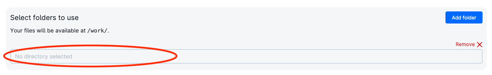

# Proteomics workshop

This workshop goes through  the analysis of proteomics data. We will start from raw output from a mass spectrometer, identify the peptides and the proteins they belong to with `searchGUI`, and perform some basic analysis using `PeptideShaker`, `python` code and some online tools.

## Introduction to proteomics

Proteomics is the field of study that deals with the analysis of the proteome, the set of proteins expressed by a cell, tissue, or organism at a certain time. The proteome is highly dynamic and changes in response to the cell's environment. Proteomics is a powerful tool to study the function of proteins, their interactions, and their modifications.

cells organelles and tissues a complex
networks of interacting molecules DNA
RNA proteins lipids salts and other
molecules shown in these representations
of cells work together in numerous and
varied ways to allow our cell to
function to stay the messenger RNA is
then translated by the ribosome which
constructor protein sequentially adding
amino acids to a growing polypeptide
chain until a stop codon is reached once
again different proteins can be produced
at different times and in different and
the same messenger RNA can be used to
produce multiple molecules of the same
protein meaning that messenger RNA
amounts don't necessarily correlate with
the number of molecules of a protein
present in a cell to different amounts
of protein or the expression level
protein molecules can also be modified
after they are produced using this
simplified cartoon as an example with
the enzyme represented here as the half
circle we can see that protein can be
cut up by proteases into smaller
functional molecules or they can be
chemically modified in numerous
different ways that can alter their
structure and their activity and some of
these modifications are shown in this
diagram here proteins can also be folded
and arranged in different ways or with
other protein molecules to form
complexes furthering further altering
their activity and function such as this
ion channel through this membrane most
often these modifications are not able
to be predicted by studying the genome
of a cell and have to be ascertained by
studying the proteins directly thus the
protein content of a cell where its
proteome is extremely dynamic and can
vary greatly from cell to cell organelle
to organelle and from tissue to tissue
and the study of the proteome is called
proteomics so while an organism's genome
is static and doesn't get significant
our jurors the organism becomes
apparently more complex whether that
organism be a bacteria a yeast a fly a
plant a chicken or us an organisms real
complexity is generated by what
genes are being expressed in a
particular moment in time or its
transcriptome and also how much of the
protein is being produced at a
particular time how these proteins are
being modified into their mature form
this is well illustrated in this example
where the caterpillar and the butterfly
both have the same genome but during
metamorphosis the proteome of many cells
changes to create the final butterfly
the study of the proteome or proteomics
is only one component of the entire
system that defines the phenotype of a
cell molecules of DNA of RNA and
proteins don't act in isolation but act
as complex and constantly interacting
systems and to ascertain the most
accurate representation of how a cell
functions a system-wide approach to
analysis referred to as systems biology
is required proteomics is only one facet
of that analysis but back to proteins
the focus of the subject proteins are
complex unlike DNA and RNA whose
chemical molecules are homogeneous
proteins are chemically heterogeneous at
the most basic level they are a linear
chain of amino acids linked together by
amide bonds there are twenty different
amino acids as shown in this diagram
with various chemical properties such as
being acidic or basic or being
hydrophobic meaning that they hate
interacting with water amino acids are
joined together in a sequence by an
amide or peptide bond to form a long
linear chain specific amino acids in
this chain can interact with each other
and form bonds to create secondary
structure the form secondary structure
such as alpha helixes and beta sheets
can then interact further with other
parts of the protein to form the top
final tertiary structure of the protein
such as this subunit of hemoglobin with
its molecule of iron bound however this
subunit is not functional alone and
needs to be assembled into a quaternary
structure consisting of four subunits of
course these protein complexes can also
be assembled from different types of
proteins
as this proteasome whose function is to
degrade unneeded protein molecules to
amino acids for recycling by the cell so
you can start to see how much more
chemically complex protein molecules can
be which has serious implications for
their analysis in proteomics the
proteins are not analyzed in isolation
because they don't occur in isolation
but all of the proteins present at a
particular moment in time in cell are
analyzed together potentially thousands
to tens of thousands of distinct protein
isoforms or Protea forms could be
present in the sample as illustrated in
this illustration based on the real
experimental data about protein
molecular size and abundance thus the
challenge of proteomics is to solubilize
or suspend in liquid all of the
molecules of as many different protein
isoforms as possible and then analyze
them in such a way that they can be
identified and their amount determined
with the diversity of chemical
structures this is a very challenging
undertaking in this subject we will gain
an understanding of protein
solubalization protein fractionation to
reduce complexity protein identification
methods and methods of quantifying
protein abundance to ascertain changes
in protein expression and how these
changes actually relate to phenotype or
to disease so how is the proteome
analyzed unlike DNA and RNA analysis we
don't have an amplifying technique like
the polymerase chain reaction to
increase sensitivity so the sensitivity
of protein analysis depends on how many
molecules of a particular protein is
present in this subject we'll learn how
to extract proteins from their native
environment and into a liquid
we can then fractionate the proteins
using their physical properties such as
size and charge to reduce complexity and
increase the depth of analysis
electrophoresis and chromatography are
then used to fractionate and separate
the proteins and mass spectrometry is
used to identify what proteins are
present in a sample and how much all of
this data is then fed into
bioinformatics pipelines to provide
lists of proteins and their abundance
this information must then be
interpreted in the
context of what the biological question
that needs answering is

## Step-by-Step tutorial

### Start the proteomics sandbox app

* Be sure you have joined the project `OMICS workshop`. Check if you have the project `OMICS workshop` from the project menu (red circle) and choose it. Afterwards, click on the `App` menu (green circle)

* Find the app `Proteomics Sandbox` (red circle), which is under the title `Featured`.
  

* Click on it. You will get into the settings window. Choose any Job Name (Nr 1 in the figure below), how many hours you want to use for the job (Nr 2, choose at least 3 hours, you can increase this later), and how many CPUs (Nr 3, choose at least 8 CPUs). Finally, click on `Add Folder` (Nr 4 in figure below)

* Now, click on the browsing bar that appears (red circle).

* In the appearing window, find the project `OMICS workshop` (Nr 1 in figure below), the drive `Day3 - Proteomics` (Nr 2) and click on `Use` where there is a folder corresponding to your name (Nr 3).

* Afterwards, it should look like this:

* Now, click on Submit to start the app (red circle)

