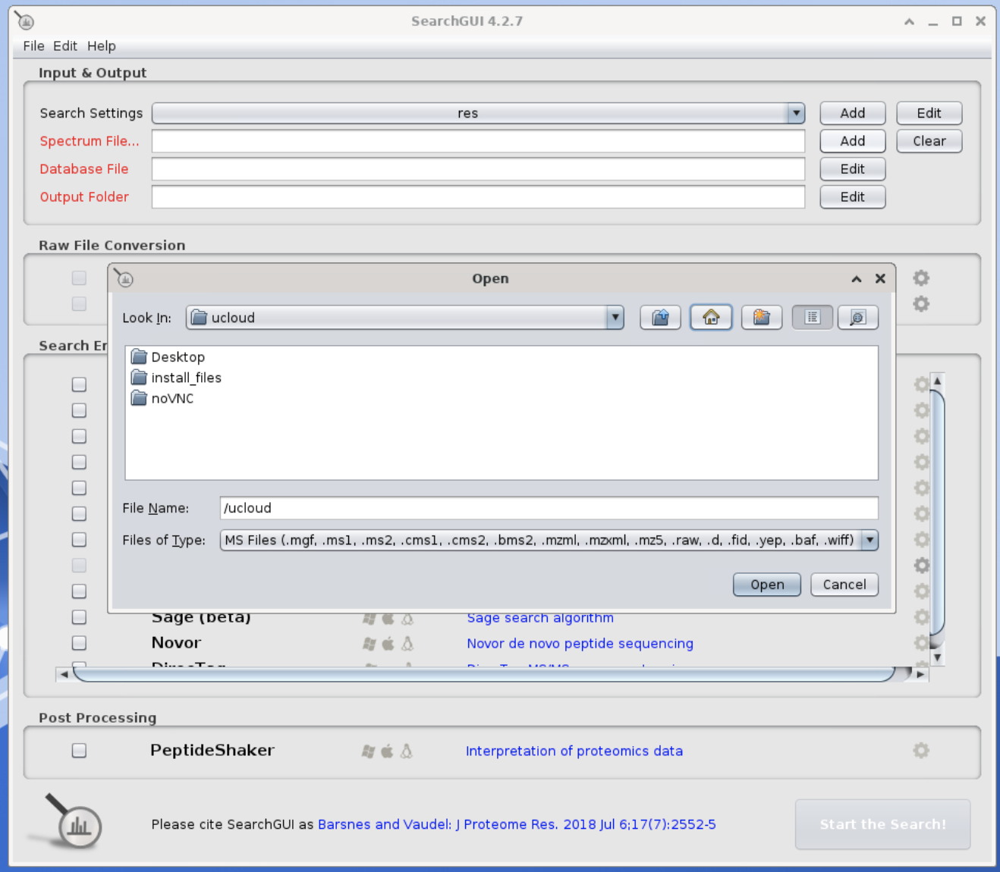

# Proteomics workshop

This workshop goes through  the analysis of proteomics data. We will start from raw output from a mass spectrometer, identify the peptides and the proteins they belong to with `searchGUI`, and perform some basic analysis using `PeptideShaker`, `python` code and some online tools.

!!! info "Goals"
    By the end of the proteomics workshop, you will

    - **Understand** how raw proteomics data is created, and **generalize** to other specific structure of Mass Spectrometry Hardware
    - Apply pipelines to **identify peptides and proteins** from raw data, and save the final identifications into tables for data analysis
    -   Generate a simple **differential proteomics analysis** between conditions
    -   Apply the resulting lists of proteins and genes to **web tools** to highlight their biological meaning

## Introductory presentation

## Step-by-Step tutorial

In what follows you will learn how to start the app to work on the tutorial. Then you have all the steps to perform the analysis of the data.

### Start the proteomics sandbox app

* Be sure you have joined the project `OMICS workshop`. Check if you have the project `OMICS workshop` from the project menu (red circle) and choose it. Afterwards, click on the `App` menu (green circle)

* Find the app `Proteomics Sandbox` (red circle), which is under the title `Featured`.
  

* Click on it. You will get into the settings window. Choose any Job Name (Nr 1 in the figure below), how many hours you want to use for the job (Nr 2, choose at least 3 hours, you can increase this later), and how many CPUs (Nr 3, choose at least 8 CPUs). Finally, click on `Add Folder` (Nr 4 in figure below)

* Now, click on the browsing bar that appears (red circle).

* In the appearing window, find the project `OMICS workshop` (Nr 1 in figure below), the drive `Day3 - Proteomics` (Nr 2) and click on `Use` where there is a folder corresponding to your name (Nr 3).

* Afterwards, it should look like this:

* Now, click on Submit to start the app (red circle)

* You will now enter a waiting queue. When the session starts, the timer begins to count down (red circle), and you should be able to open the interface through the button (green circle). Note the buttons to add time to your session (blue circle) and the button to stop the session when you are done (pink circle)

* Open the interface by clicking on the button (green circle of figure above). You will enter a virtual machine (an operating system running into another computer) where you have various tools installed and visible on the desktop. A welcoming webpage with a short description of the sandbox will apear - you can have a quick look at it and close it.

### Quantify proteins with `searchGUI`

The first step of a proteomics analysis is the quantification of proteins from raw mass spectrometry data. This data - when produced by a Fisher Thermo mass spectrometer - is in `.raw` format, and contains the histograms created over the measuring experiment. The histogram represents the detected mass/charge ratio of various peptides (see figure below).

*Figure: histogram of mass/charge of peptides detected by the mass spectrometer over the time of the experiment. Peptides have been separated by liquid chromatography so that they can be correctly identified. Each peak is used as the best measure of a peptide.*

The software `searchGUI` compares those peaks to calculate their differences in mass/charge. Each difference is used to identify a unique aminoacid connecting two peptides. Through algorithmics procedures (the most famous of which are `Xtandem` and `MSfragger`, but there are many others) the peptides are chained together compatibly with the aminoacids identity and a reference proteome.

* Open the `searchGUI` software by double-clicking on the icon on the desktop. You will see a window like this:

* For the option `Search Settings` click on `Add`. Choose any name and click on `Spectrum Matching`. Here there is a default setting which is good for most of the cases. Click directly on `OK` to confirm. You should then be able to click on `Save`.

* In the main window, click on `Add` for the option `Spectrum File`. This is the file in `.raw` format from the Mass Spectrometer. Click on the button `up one level` (red circle in figure) and find the file `/work/YOUR_NAME/searchGUI/Azoospermic_23/Azoospermic_23.raw`. 

* Use `Add` for the option `Database File`, which is the reference file containing known proteins and is in `.fasta` format. You will find it in the raw data folder `/work/YOUR_NAME/searchGUI/Azoospermic_23`. When choosing the fasta file, a window with some info might open: just click on ok.

* For the option `Output Folder` click on `Add` and choose the raw data folder `/work/YOUR_NAME/searchGUI/Azoospermic_23`.

* Now you should be back to the main window. Choose the `X! Tandem` method as search engine. Now you are ready to click on `Start Search` (green button in figure below) and wait for the process to finish. It should take around 10 minutes. There are other 5 samples for which this process has already been executed beforehand. While you wait, you can start reading the information about the next step.

### Filtering and Exploring quantified data with `Peptide Shaker`

After the identification step is ended, we can open the result file and explore the data. The software `Peptide Shaker` filters the data annotating which protein have been confidently/dubiously according to a false discovery rate threshold. With `Peptide Shaker` we can also look at some statistics about the data, and explore the proteins and peptides identified.

* Open the `Peptide Shaker` software by double-clicking on the icon on the desktop. Click on `New project` in the appearing window. Then you will see a window like this:

* Write any name for `Project Reference`. For `Identification File`, choose `Add`, and find the file `/work/YOUR_NAME/searchGUI/Azoospermic_23/searchgui_out.zip`. You will also find automatically the fasta file after this choice, but a warning windows will tell you to find yourself a file in format `.mzml` (figure below)

* For the option `Spectrum File`, find the file `Azoospermic_23.mzML` (which is a simple conversion of the `.raw` file into a more common format) in the folder `/work/YOUR_NAME/searchGUI/Azoospermic_23`.

* In `Identification`, open the dropdown menu. You should find the name of the `searchGUI` project before and choose it. 

* At the end you should have a window like the one below. Click on the green button to load the data!

* The main window presents tables with proteins, peptides and spectra. You can click on the column names to sort the data by a specific factor. You can also click on the buttons on the top to see the statistics of the data. If you click on the accession name of a protein, you will open the related information webpage of the  `Uniprot` database. Try to click on the first protein, and you will see how it is related to the production of sperm.

* On the right side of the window, there are other tabs you can open. For example, the tab `Spectrum ID` shows the histogram of the mass/charge ratio of the peptides identified. You can click on the peaks to see the related information.

* `Modifications` will show at which aminoacids changes have been identified. You can click on the modifications to see the related information.

* `3D structure` will show you the 3d plots of a protein's peptides inside a protein/protein complex, including its modifications.
  

* `GO analysis` will show you the gene ontology terms associated to the proteins identified. You can click on the terms to see the related information.

* `Validation` will show you some quality plots related to the data. Here you can change a FDR (`False Discovery Rate`) threshold for the identification of proteins, which by default is set at 1%. Try to change it to 5% and see how the number of identified proteins changes.

* `Validation` will show you some quality plots related to the data. Here you can change a FDR (`False Discovery Rate`) threshold for the identification of proteins, which by default is set at 1%. Try to change it to 5% and see how the number of identified proteins changes.

After you have played with `PeptideShaker`, you can export the results into tables, that can be conveniently opened in Excel, but also used for analysis in `Python` as we will do shortly. We need to export the protein report, including all the information you could see in the opening page of `PeptideShaker`.

* On the top menu, click on `Export --> Identification Features` and choose `Default Protein Report`. Save it in the folder `/work/YOUR_NAME/searchGUI/Azoospermic_23` with its default name. Do the same for the `Default Peptide Report`, which contains information useful for data normalization.

### Data analysis in Python

Now we will use the `jupyterlab` interface to analyze the data with the `Python` language. `jupyterlab` is a web interface that allows you to write code in `Python` (but also any other language) and visualize the results in the same page. You can also write text and visualize images, so it is a very useful tool for teaching and learning data analysis.

* Open the `jupyterlab` interface by clicking on `Applications` (top-left corner of the desktop), then `Development --> Jupyter Notebook`.

* The browser will launch in a few, and in the webpage that shows (figure below) find and open the file `YOUR_NAME/Jupyterlab/analysis.ipynb`

* The code shows in a page as the one in the figure below. The file you just opened is a `notebook` containing text and code. Each piece of text or code is contained in a cell which can be selected by clicking on it, and you usually read everything from the top of the document to the bottom. You can run a selected cell by clicking on the `Run` symbol on the top menu, or more easily with the keys `shift+enter`.

Go through all the code and read the instructions to perform the comparison between samples from Normal and Infertile patients and find interesting proteins and genes which are predominant in one of the two conditions. 

When you reach the end of the notebook, continue reading this tutorial to apply some web tools to the results from the code.

## Data analysis with web tools

We apply various tools to the resulting protein lists of the `Python` code. 

### STRING

STRING is a database where you can input one or more proteins, and it will show you the network of known proteins interactions within your input list. Moreover, it will use the database to find other proteins known to be interacting with the provided list. It is a very useful tool to understand the role of a protein in a biological process, and to find other proteins that are related to it.

To generate a network, 

- go on the [STRING webpage](https://string-db.org). Choose `Search` on top of the page, and from the left menu choose `Multiple Proteins`. 

- Copy the column with the protein names found for the `Normal` condition in the Notebook (the list should have 28 proteins). Paste it in the search prompt, and choose the homosapiens organism in the options.
-  Then click on `Search`. A window with the protein names that match the database is shown. Click on `Continue`.

You will see a network with nodes that represent proteins, and edges that are their known connections (co-expressions, physical interaction, ...) as in figure below. 

There are buttons allowing you to do a variety of actions. An interesting thing is the possibility of **clustering** and using the button **More** to search in the STRING database for further proteins that are known to interact with the ones in the network. The **analysis** button gives you significant matches in many databases (protein functions, tissues, pathways, ...).

### 3D structure comparison

The way a protein is folded in 3D is very important for its function. The 3D structure is usually determined by X-ray crystallography, but it is also possible to predict it from the aminoacid sequence (using for example Google's `Alphafold`). Such a prediction is saved in a file in format `.pdb`. The 3D structure is usually represented as a ribbon connecting the aminoacids (picture below).

Usually you want to compare proteins that have a connection in the STRING network, or proteins arising from genes that are found to be coexpressed in the same cell type (if you have been analyzing bulkRNA or single-cell-RNA sequencing data).

In our example we look at two proteins connected in STRING, which corresponds to the genes AP1B1 and AP2B1. Their structures in `pdb` format are already downloaded in the folder `/work/YOUR_NAME/3D_structure`, downloaded from the 3D structure database on the [Alphafold home page](https://alphafold.ebi.ac.uk).

#### Comparison with DALI

`DALI` is a protein comparison software which has been made available online by its creators. You can provide it with two or more `.pdb` files and it will compare them, giving you a score of similarity.

- Go on the [DALI webpage](https://ekhidna2.biocenter.helsinki.fi/dali/). Click on `Pairwise` to compare two proteins: this compares one protein to a list of proteins (`All against all` can be used if you want to do all possible pairwise comparisons of a group of `.pdb` files).

- Upload the two `.pdb` files.

- Submit the analysis request. Wait some time for the results to be calculated. At some point, you should see two choices: interactive html report or text report. Choose the first one.

- You will see the result of the statistical test for similarity. Here a `Z`-score above 2 means you have been reaching some similarity. In our case the Z-score is really high, and the `%` of identical sequence is 86% (picture below). This means a very similar 3D structure and a very similar sequence of aminoacids - thus some degree of simnilarity in their functionality.

**Note:** If you want to open and compare protein structures on your computer, you can use the software `pyMOL`, which is beautiful for exploring `.pdb` files. However, it is free only through the website `https://pymol.org/edu`, where you can only use it for courses/study, but not for publishing. If you want to use it for publishing, you need to buy a license or use free softwares like `Avogadro`, which is also a quite good freeware.

### Exploring reactome pathways

A very useful tool is the REACTOME database, which performs a statistical analysis of a protein list and provides you with significant pathways that are enriched in the list. 

- Go on the [REACTOME webpage](https://reactome.org). Click on `Analysis tools` on the home page.

- Paste the same protein list used for STRING into the prompt for the proteins to analyse (figure below)
  

- A window with the option of using an additional database of interactions is shown. You can choose to use it as well and press `Continue`

- You will see a graphical representation, where each graph is a category of interactions. Some graphs have branches colored in yellow: those are parts of interactions databases significant (with pvalue<0.05) for our search and showing protein functions. Below, you can see a list of the significant functions, and you can click on them to see the related information and zoom into the network. There are options to export tables and pictures of the results.

- For example, we can see the `inactivation of CSF3 signaling` pathway. Reduced CSF3 signaling is known to be associated with higher sperm motility, and this matches the fact that we are looking at proteins more expressed in fertile samples.

!!! abstract "Other resources"

    1. A really good series of introductory lectures in Proteomics (with explanations of mass spectrometry and proteomics analysis) [on youtube](https://www.youtube.com/@MatthewPadula/videos)
    2. [Further Tutorials](https://www.compomics.com/bioinformatics-for-proteomics/) for proteomics by the team behind `PeptideShaker` and `searchGUI`