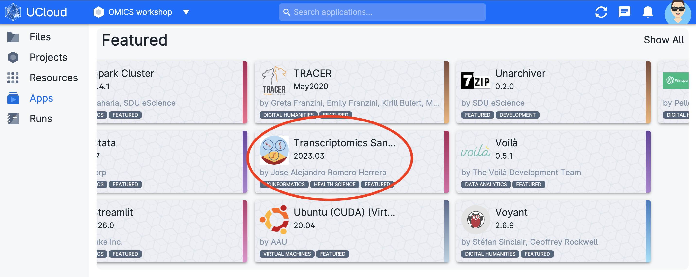
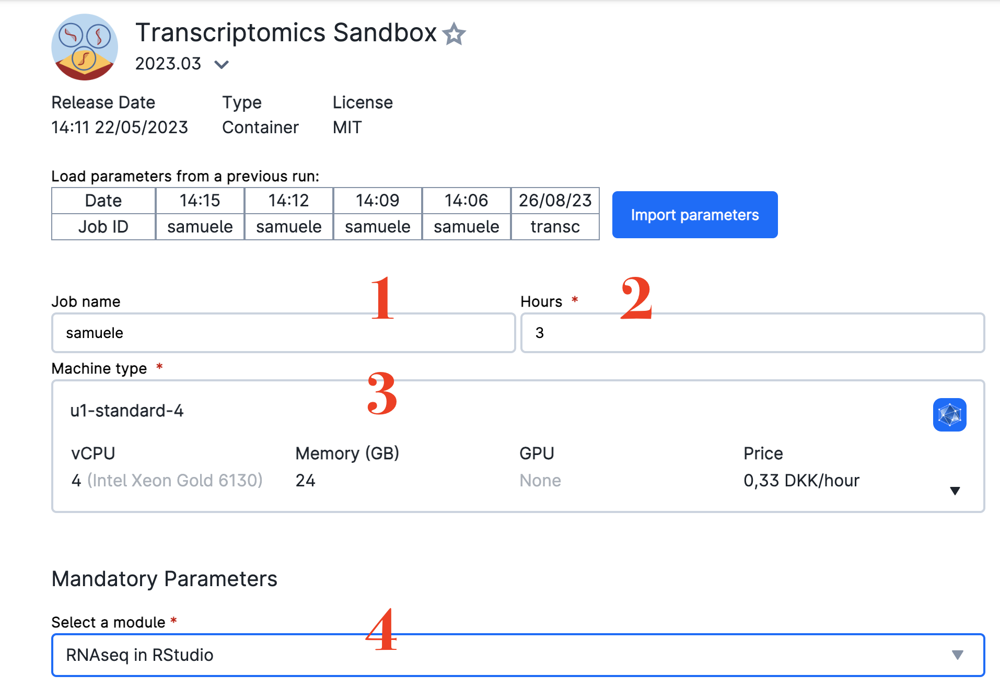
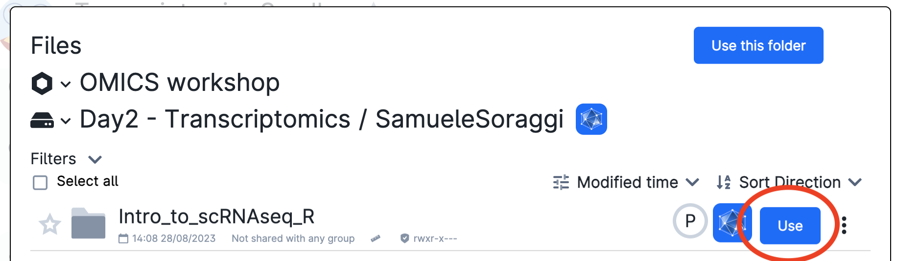
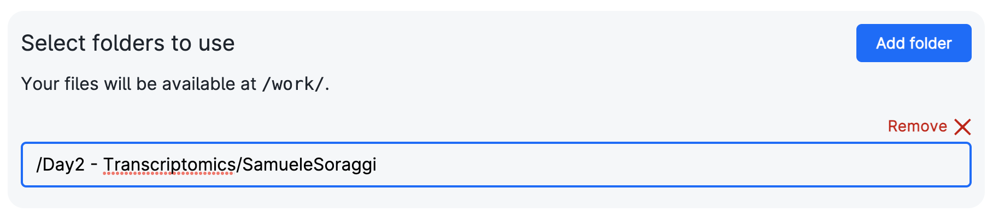
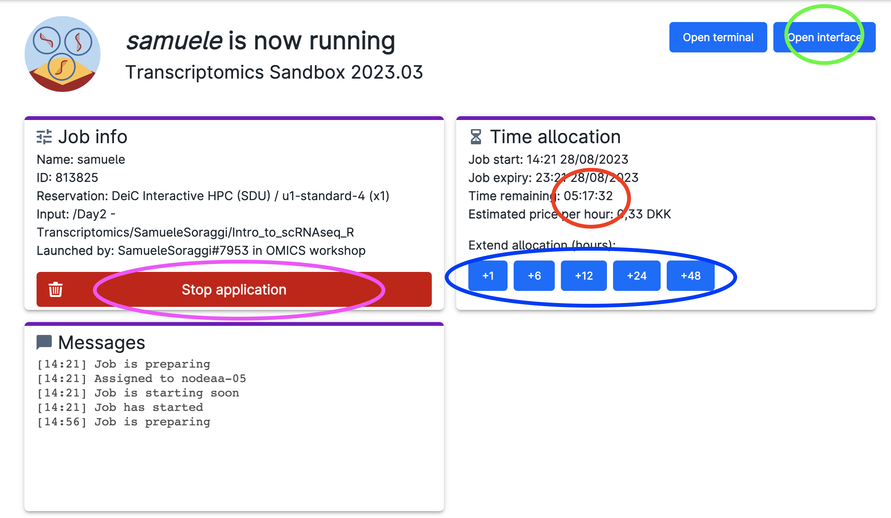
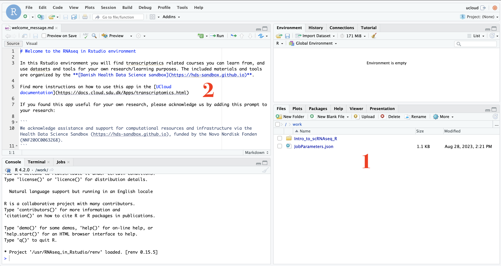

# Transcriptomics workshop

This workshop goes through the analysis of Single Cell Transcriptomics data from expression matrix filtering, to downstream analysis (dimensionality reduction, clustering, differential gene expression, external database access). In this workshop the data is generate with the droplet technology Chromium 10x (v2 chemistry).

!!! info "Goals"
    By the end of the transcriptomics workshop, you will know how to perform an extensive analysis of single cell transcriptomics data, from gene expression matrix to biological interpretation. In particular, you will be able to:

    - **determine and apply** proper filtering criteria on the expression matrix
    - **apply and calibrate** dimensionality reduction methods (PCA and UMAP) 
    - **Cluster, subcluster and annotate** cell types in the data
    - **Perform and use** differential gene expression to confirm cluster annotation and other gene-based analysis
    - **extract information** from external databases for **GO terms analysis** and other applications

## Introductory Presentation (slides and video)

<a href="assets/OMICSworkshop2023Transcriptomics.pdf" download>Download the slides in pdf format from this link</a>

## Step-by-Step tutorial

In what follows you will learn how to start the app to work on the tutorial. Then you have all the steps to perform the analysis of the data. The Transcriptomics app contains various courses you can do on your own, but right now we will simply start Rstudio with all the necessary packages preinstalled and add our own files for the tutorial.

### Start the genomics sandbox app

The transcriptomics sandbox is on `Ucloud`, an interactive online platform from the [University of Southern Danmark eScience center](https://escience.sdu.dk/) that allows users to execute softwares and computer code directly from their browser. If you are enrolled in a danish university or hospital, you can access the platform for free.

Please follow these instructions to access uCloud and get to work on the tutorial:

* Be sure you have joined the project `OMICS workshop`. Check if you have the project `OMICS workshop` from the project menu (red circle) and choose it. Afterwards, click on the `App` menu (green circle)

* Find the app `Transcriptomics Sandbox` (red circle), which is under the title `Featured`.
  

* Click on it. You will get into the settings window. Choose any Job Name (Nr 1 in the figure below), how many hours you want to use for the job (Nr 2; choose at least 3 hours, you can increase this later), and how many CPUs (Nr 3, choose at least 4 CPUs). Choose the course `RNAseq in RStudio` from the drop-down menu (Nr 4). Finally, click on the blue button `Add Folder`.

* Now, click on the browsing bar that appears (red circle).

* In the appearing window, find the project `OMICS workshop` (Nr 1 in figure below), the drive `Day2 - Transcriptomics` (Nr 2) and click on the folder with your name (Nr 3, where you see my name, but you should choose your own name of course).

* Then click on the blue button `Use` on the right side of the folder  `Intro_to_scRNAseq_R` inside your personal folder (red circle). In this way you have your personal tutorial material.

* Afterwards, you should have something like this in the settings page:

* Now, click on Submit to start the app (the button is on the right side of the settings page)

* You will now enter a waiting queue. When the session starts, the timer begins to count down (red circle), and you should be able to open the interface through the button (green circle). Note the buttons to add time to your session (blue circle) and the button to stop the session when you are done (pink circle)

* Open the interface by clicking on the button (green circle of figure above). Sometimes you are warned of a missing connection: simply refresh the page. You will enter `Rstudio`, well-known interface to code in `R`. Here there is a file browser (Nr 1), and the code window (Nr 2), and you can change the size of the panels by dragging the separators.

* Open the folder `Intro_to_scRNAseq_R` folder in the browser, and click on the file `scRNAseq_Tutorial_R.Rmd`. You just opened a so-called `R Markdown` document containing text, figures and code. Click now on `visual` (red circle) to see the tutorial in a more readable format. The executable code is inside cells to be executed in order from the first to the last using the green arrow (blue circle)

* Read carefully through the notebook's tutorial and execute the code cells in order from the top to the bottom of the tutorial. You will see some outputs in your notebook. 

!!! warning "For those who want more"
    - The tutorial is quite long. If you do not finish it all at once, do not worry! You can run it again at any time - the workshop access on `uCloud` and all the files will be kept available after the workshop.
    - The transcriptomics Sandbox App on uCLoud contains the whole courses on single cell RNA sequencing analysis and bulk RNA analysis. You can run them at any time as well using the computing credit of the project `OMICS workshop`, or your own credits.