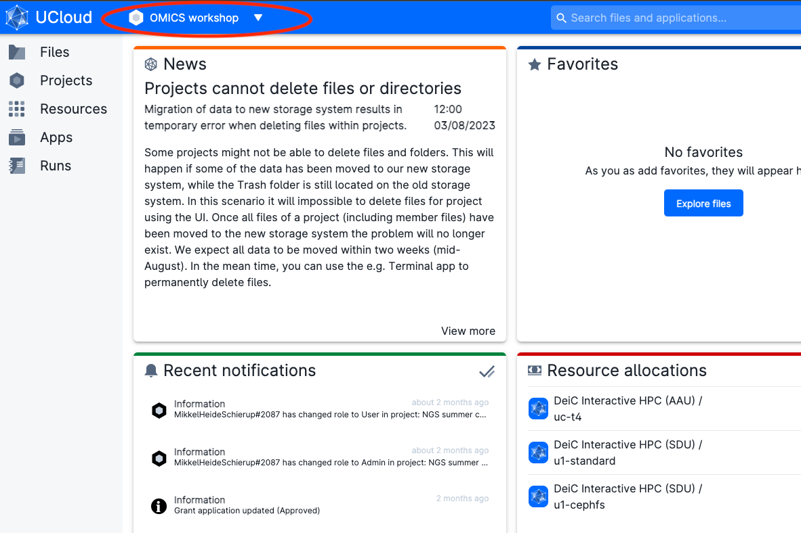

# Access through uCloud

`Ucloud` is an interactive online platform from the [University of Southern Danmark eScience center](https://escience.sdu.dk/) that allows users to execute softwares and computer code directly from their browser. If you have an account from a danish university, hospital, and other institutions, you can access the platform for free and try the course.

## Join the workshop project containing the data

* Log onto ucloud at the address [http://cloud.sdu.dk](http://cloud.sdu.dk) using the university/institution credentials you possess.

* If you are participating in the OMICS focus group workshop, click **AFTER logging in** on [this link](https://cloud.sdu.dk/app/projects/invite/41d21e18-07f8-4cab-a78d-34ec46cb8443). You should see a message on your browser where you have to accept the invitation to the project. This will add you to a project on uCloud, where we have data and extra computing credit for the course. 

* Be sure you have joined the project. Check if you have the project `OMICS workshop` from the project menu (red circle). Afterwards, click on the `App` menu (green circle)

**Note:** The project `My Workspace` is instead your private space where you have some free hundreds of CPU hours and GBs of memory.